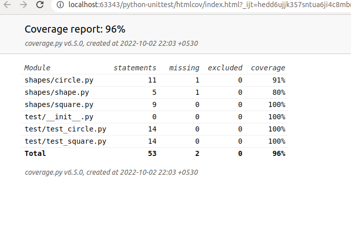
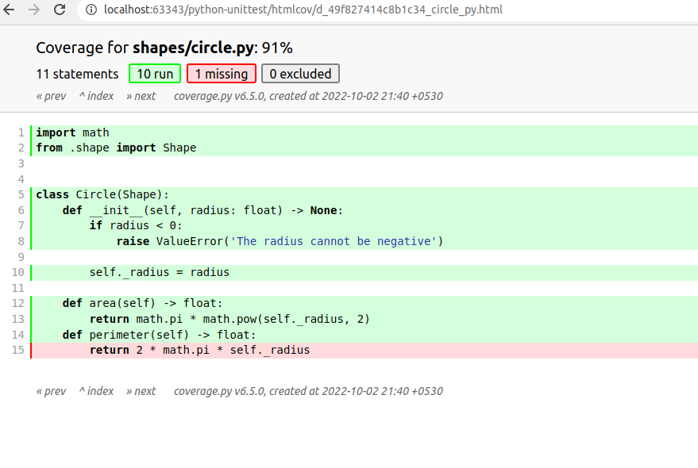

# Python Unit testing, Code coverage examples

### Project structure
    - python-unittest
        |- shapes
        |   |- circle.py
        |   |- shape.py
        |   |- square.py
        |- test
            |- test_circle.py
            |- test_square.py
            |- __init__.py

### Prerequiste 
    
    Install Packages

    (venv) csk@csk-ai-revolution:~/IdeaProjects/python-unittest$ pip install -r requirements.txt
### Unit Test Case
    
#### Running All test cases
    (venv) csk@csk-ai-revolution:~/IdeaProjects/python-unittest$ python -m unittest discover -v
    test_area (test.test_circle.TestCircle) ... ok
    test_circle_instance_of_shape (test.test_circle.TestCircle) ... ok
    test_create_circle_negative_radius (test.test_circle.TestCircle) ... ok
    test_area (test.test_square.TestSquare) ... ok
    test_create_square_negative_length (test.test_square.TestSquare) ... ok
    test_square_instance_of_shape (test.test_square.TestSquare) ... ok
    
    ----------------------------------------------------------------------
    Ran 6 tests in 0.000s
    
    OK
#### Running a single test module
    (venv) csk@csk-ai-revolution:~/IdeaProjects/python-unittest$ python -m unittest test.test_circle -v
    test_area (test.test_circle.TestCircle) ... ok
    test_circle_instance_of_shape (test.test_circle.TestCircle) ... ok
    test_create_circle_negative_radius (test.test_circle.TestCircle) ... ok
    
    ----------------------------------------------------------------------
    Ran 3 tests in 0.000s
    
    OK

#### Running a single class module
    (venv) csk@csk-ai-revolution:~/IdeaProjects/python-unittest$ python -m unittest test.test_circle.TestCircle -v
    test_area (test.test_circle.TestCircle) ... ok
    test_circle_instance_of_shape (test.test_circle.TestCircle) ... ok
    test_create_circle_negative_radius (test.test_circle.TestCircle) ... ok
    
    ----------------------------------------------------------------------
    Ran 3 tests in 0.000s
    
    OK

#### Running a single test method
    (venv) csk@csk-ai-revolution:~/IdeaProjects/python-unittest$ python -m unittest test.test_circle.TestCircle.test_area -v
    test_area (test.test_circle.TestCircle) ... ok
    
    ----------------------------------------------------------------------
    Ran 1 test in 0.000s
    
    OK

### Unit testing code coverage

#### Generate coverage data
    (venv) csk@csk-ai-revolution:~/IdeaProjects/python-unittest$ python -m coverage run -m unittest
    ......
    ----------------------------------------------------------------------
    Ran 6 tests in 0.001s
    
    OK

#### Generate coverage report

    Name                  Stmts   Miss  Cover
    -----------------------------------------
    shapes/circle.py         11      1    91%
    shapes/shape.py           5      1    80%
    shapes/square.py          9      0   100%
    test/__init__.py          0      0   100%
    test/test_circle.py      14      0   100%
    test/test_square.py      14      0   100%
    -----------------------------------------
    TOTAL                    53      2    96%

#### Generate coverage report html format
    (venv) csk@csk-ai-revolution:~/IdeaProjects/python-unittest$ python -m coverage html 
    Wrote HTML report to htmlcov/index.html

#### Coverage report html complete module

#### Coverage report html single module

