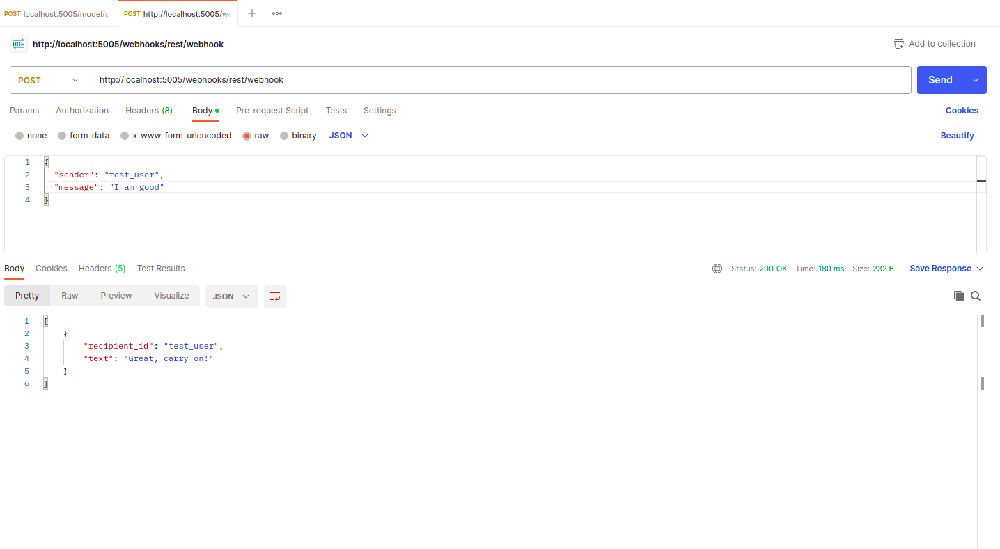
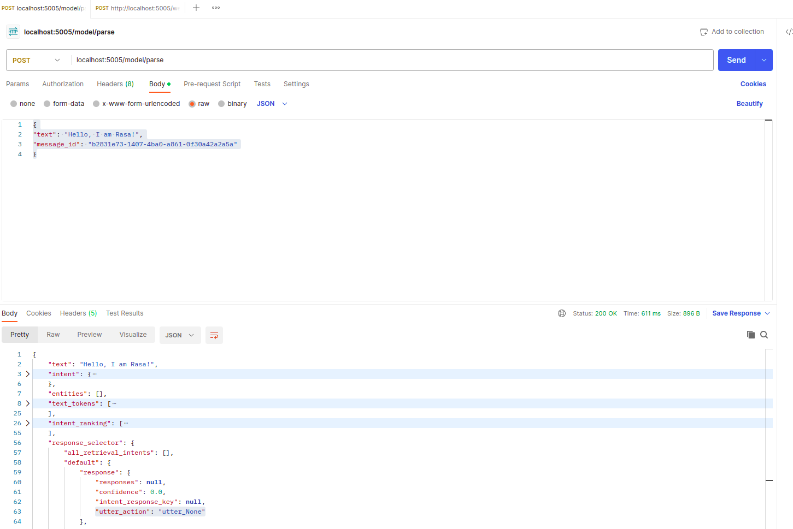

# Ras Chat Bot

### Initialize rasa - built model
    (venv) csk@csk-ai-revolution:~/IdeaProjects/python-unittest/legabot$ rasa init
    
    (venv) csk@csk-ai-revolution:~/IdeaProjects/python-unittest/legabot$ rasa run -enable-api
    2023-06-07 16:39:29 INFO     root  - Starting Rasa server on http://0.0.0.0:5005
    2023-06-07 16:39:34 INFO     rasa.core.processor  - Loading model models/20230607-162104-mild-gofer.tar.gz...
    2023-06-07 16:40:08 WARNING  rasa.shared.utils.common  - The UnexpecTED Intent Policy is currently experimental and might change or be removed in the future 🔬 Please share your feedback on it in the forum (https://forum.rasa.com) to help us make this feature ready for production.
    2023-06-07 16:40:23 INFO     root  - Rasa server is up and running

### Conversational Bot
    POST method 
    url - http://localhost:5005/webhooks/rest/webhook
    body json - {
                "sender": "test_user",  
                "message": "hello"
                }

### Get Intent
    POST method 
    url - http://localhost:5005/model/parse
    body json - {
                "text": "Hello, I am Rasa!",
                "message_id": "tt"
                }
